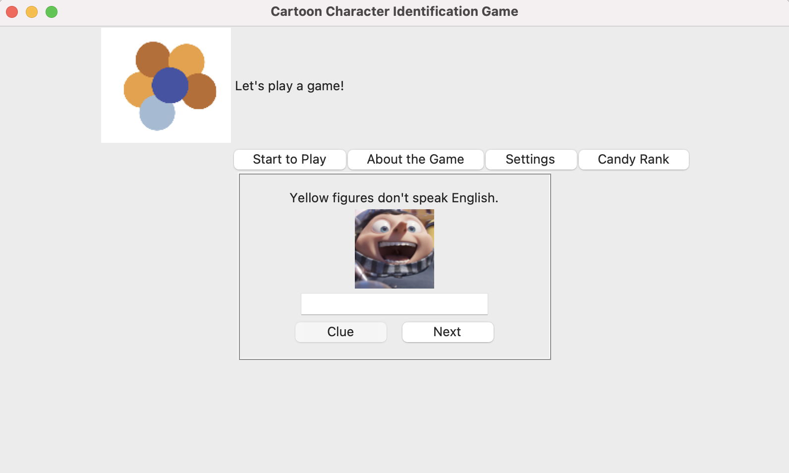

## Table of contents
* [General info](#general-info)
* [Technologies](#technologies)
* [Setup](#setup)
* [Author's Note](#note)

## General info
This is a Cartoon Character Identification Game. There are four main menus: `Start to Play`, `About the Game`, `Settings` and `Candy Rank`. `Start to Play` will lead you to the game, and you need to enter your name before start to play. For each question, you will have a chance to ask for a clue, otherwise you can enter the answer and click `Next`. In `About the Game`, you will see a brief introduction for the game, and have a chance to contribute to the game by adding new questions. In `Settings`, you can change the frame color as your preference. In `Candy Rank`, you will see all the players and how many candies they have.


<p align="center">
  
</p>

## Technologies
Project is created with: Python, Tkinter, PIL and sqlite3.

## Setup
To run this project, install it locally and run:

```
$ cd 'where you stored the file'
$ python main.py
```
## Author's Note

This game is adapted from a brand identification game. I believe that no matter how old I am, I will always love cartoons. And I appreciate all the cartoon characters that taught me integrity, honesty, friendship, confidence and love.
